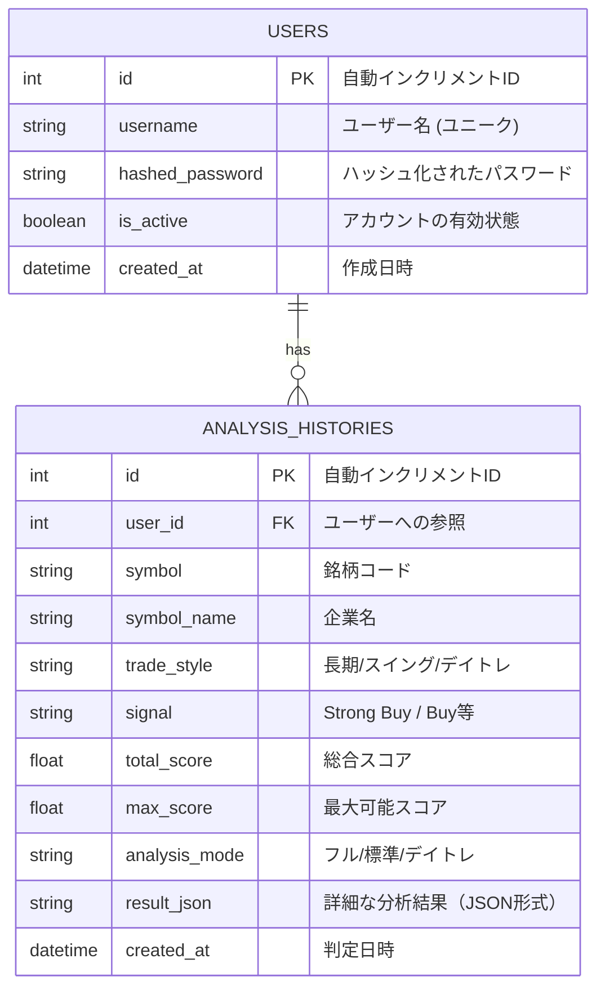

# TradeAlgo Pro データベース仕様書

本ツールのデータ管理は、`backend/stock_trading.db` (SQLite) によって行われています。  
SQLAlchemy（ORM）を通じて各テーブルの操作・管理がなされます。

## 📊 ER図 (Entity Relationship Diagram)

---

## 🛠 テーブル定義詳細

### 1. `users` テーブル
ユーザー認証情報を保持します。

| カラム名 | 型 | 制約 | 説明 |
| :--- | :--- | :--- | :--- |
| `id` | `Integer` | `Primary Key` | ユーザーを一意に識別する内部ID。 |
| `username` | `String` | `Unique`, `Index` | ログインに使用するユーザー名。 |
| `hashed_password`| `String` | | bcrypt等でハッシュ化されたパスワード。 |
| `is_active` | `Boolean` | `Default: True` | アカウントの状態。 |
| `created_at` | `DateTime` | | 登録日時。 |

### 2. `analysis_histories` テーブル
実行された株式分析の結果を保存します。

| カラム名 | 型 | 制約 | 説明 |
| :--- | :--- | :--- | :--- |
| `id` | `Integer` | `Primary Key` | 履歴レコードの一意識別ID。 |
| `user_id` | `Integer` | `Foreign Key` | `users.id` への参照。 |
| `symbol` | `String` | `Index` | 判定を行った銘柄（例: 7203, AAPL）。 |
| `symbol_name` | `String` | `Index` | 企業名（例: ソニーグループ, Apple Inc.）。 |
| `trade_style` | `String` | | 選択したスタイル（`day`, `swing`, `long_hold`）。 |
| `signal` | `String` | | 分析によるシグナル（`Buy`, `Sell` 等）。 |
| `total_score` | `Float` | | 算出された総合スコア。 |
| `max_score` | `Float` | | その時点での最大達成可能スコア。 |
| `analysis_mode` | `String` | | `フルモード`, `デイトレモード` 等。 |
| `result_json` | `String` | | 全レイヤーの詳細データを含むJSON文字列。 |
| `created_at` | `DateTime` | | 判定を実行した日時。 |

---

## 🔒 セキュリティとインデックス

- **インデックス**:
    - `users.username`: ユーザー認証を高速化するため。
    - `analysis_histories.symbol`: 特定の銘柄の過去履歴を素早く抽出するため。
    - `analysis_histories.symbol_name`: 企業名での検索を高速化するため。
- **データ永続化**:
    - `SQLite` を使用しているため、プロジェクト直下の `backend/stock_trading.db` にバックアップなしで直接保存されます。開発用であれば十分ですが、本番環境移行時は PostgreSQL 等への切り替えを推奨。
