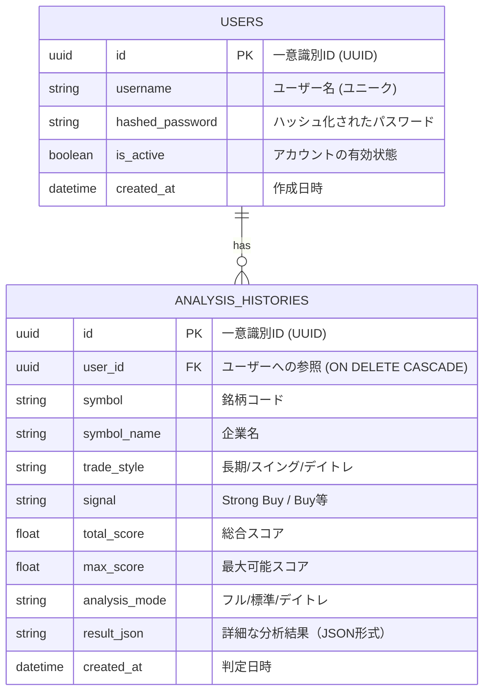

# TradeAlgo Pro データベース仕様書

本ツールのデータ管理は、`backend/stock_trading.db` (SQLite) によって行われています。
SQLAlchemy（ORM）を通じて各テーブルの操作・管理がなされます。

## ER図 (Entity Relationship Diagram)

---

## 🛠 テーブル定義詳細

### 1. `users` テーブル

ユーザー認証情報を保持します。

| カラム名            | 型           | 制約                  | 説明                                   |
| :------------------ | :----------- | :-------------------- | :------------------------------------- |
| `id`              | `Uuid`     | `Primary Key`       | ユーザーを一意に識別する内部ID。       |
| `username`        | `String`   | `Unique`, `Index` | ログインに使用するユーザー名。         |
| `hashed_password` | `String`   |                       | bcrypt等でハッシュ化されたパスワード。 |
| `is_active`       | `Boolean`  | `Default: True`     | アカウントの状態。                     |
| `created_at`      | `DateTime` |                       | 登録日時。                             |

### 2. `analysis_histories` テーブル

実行された株式分析の結果を保存します。

| カラム名          | 型           | 制約            | 説明                                                          |
| :---------------- | :----------- | :-------------- | :------------------------------------------------------------ |
| `id`            | `Uuid`     | `Primary Key` | 履歴レコードの一意識別ID。                                    |
| `user_id`       | `Uuid`     | `Foreign Key` | `users.id` への参照。ユーザー削除時に連動して削除されます。 |
| `symbol`        | `String`   | `Index`       | 判定を行った銘柄（例: 7203, AAPL）。                          |
| `symbol_name`   | `String`   | `Index`       | 企業名（例: ソニーグループ, Apple Inc.）。                    |
| `trade_style`   | `String`   |                 | 選択したスタイル（`day`, `swing`, `long_hold`）。       |
| `signal`        | `String`   |                 | 分析によるシグナル（`Buy`, `Sell` 等）。                  |
| `total_score`   | `Float`    |                 | 算出された総合スコア。                                        |
| `max_score`     | `Float`    |                 | その時点での最大達成可能スコア。                              |
| `analysis_mode` | `String`   |                 | `フルモード`, `デイトレモード` 等。                       |
| `result_json`   | `String`   |                 | 全レイヤーの詳細データを含むJSON文字列。                      |
| `created_at`    | `DateTime` |                 | 判定を実行した日時。                                          |

---

## セキュリティとインデックス

- **インデックス**:
  - `users.username`: ユーザー認証を高速化するため。
  - `analysis_histories.symbol`: 特定の銘柄の過去履歴を素早く抽出するため。
  - `analysis_histories.symbol_name`: 企業名での検索を高速化するため。
- **データ永続化**:
  - **開発環境**: `SQLite` を使用し、`backend/stock_app.db` に保存されます。
  - **本番環境**: **Supabase (PostgreSQL)** を使用します。環境変数 `DATABASE_URL` に接続文字列を設定することで自動切り替えが行われます。
  - **自動変換**: Supabase が提供する `postgres://` 形式を、SQLAlchemy が要求する `postgresql://` 形式にサーバー起動時に自動変換して接続します。

---

## リレーションシップと制約

### カスケード削除 (Cascade Delete)

本システムでは、ユーザーが退会した際に関連するデータが残らないよう、SQLAlchemy レベルでカスケード削除を設定しています。

- `User` クラスにおいて `histories` リレーションシップに `cascade="all, delete-orphan"` を設定。
- これにより、`User` オブジェクトを削除すると、紐付いている全ての `AnalysisHistory` レコードもデータベースから自動的に削除されます。
